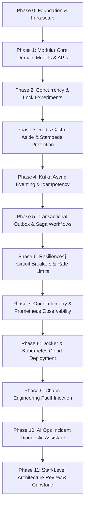

# ⚡ Flash Sale Platform — Master Base Repository & System Blueprint

Welcome to the **Flash Sale Platform** engineering project. This repository serves as the master blueprint, system design specification, local infrastructure orchestrator, and architecture decision index for developers building the high-scale flash sale system.

> **Target GitHub URL**: [https://github.com/shivam-nitm/Flash_Sale_Platform](https://github.com/shivam-nitm/Flash_Sale_Platform)

---

## 🎯 Business & Technical Problem Statement

In a high-scale flash sale (e.g., limited-edition smartphone drop), **millions of concurrent users** attempt to purchase a very limited stock (e.g., 1,000 units) within a tiny time window.

### Key Operational Challenges:
1. **Overselling Prevention**: Stock must never drop below 0. `available + reserved + sold == initial_stock` is a strict invariant.
2. **High Contention & Read Pressure**: Millions of reads hit the catalog endpoint simultaneously. Database lock contention spikes exponentially without caching and isolation.
3. **Partial Failure & Eventual Consistency**: Asynchronous checkout workflows across Inventory, Order, Payment, and Fulfillment services must handle network splits, crash windows, and compensations cleanly without losing state or money.
4. **Resilience & Observability**: Third-party payment gateways and shipping carriers introduce latency spikes. The system must shed load predictably, isolate failures, and provide end-to-end distributed tracing.

---

## 🏗️ Repository Architecture & Developer Sub-Repositories

To enable parallel development across domain squads, the system is decomposed into 8 specialized microservice and tooling repositories:

| Repository Name | Domain / Responsibilities | Tech Stack | Primary Requirements Mapped |
| :--- | :--- | :--- | :--- |
| 📦 [**`catalog-service`**](./catalog-service) | Product metadata, CRUD APIs, Redis cache-aside, cache stampede protection | Java 21, Spring Boot, PostgreSQL, Redis | FR-001, FR-006, FR-007 |
| 🛡️ [**`inventory-service`**](./inventory-service) | Stock reservations, optimistic/pessimistic locking, Redis Lua atomic decrement, TTL expiration worker | Java 21, Spring Boot, PostgreSQL, Redis | FR-002, FR-004, FR-005 |
| 🛒 [**`order-service`**](./order-service) | Order creation, explicit state machine (`CREATED` -> `FULFILLED`), Transactional Outbox pattern | Java 21, Spring Boot, PostgreSQL, Kafka Producer | FR-003, FR-008, FR-011 |
| 💳 [**`payment-fulfillment-service`**](./payment-fulfillment-service) | Payment gateway simulator, shipment dispatch, Saga Orchestrator & compensation handlers | Java 21, Spring Boot, PostgreSQL, Kafka | FR-012 |
| 🚌 [**`event-bus`**](./event-bus) | Kafka topic definitions, Avro/JSON schemas, Outbox relay processor, Idempotent consumers, DLQ | Kafka, Avro, Java 21, Spring Kafka | FR-008, FR-009, FR-010 |
| 📊 [**`infra-observability`**](./infra-observability) | Docker Compose, Kubernetes manifests, OpenTelemetry collector, Prometheus RED/USE metrics, Grafana | Docker, K8s, OpenTelemetry, Prometheus, Grafana | FR-014, FR-015 |
| 🧪 [**`testing-chaos-lab`**](./testing-chaos-lab) | k6 load tests (concurrent purchase, stampede), Chaos fault injection (Redis/Kafka outage, DB latency) | k6, Python, Chaos Mesh / Shell | FR-016, C-001..C-008 |
| 🤖 [**`ai-ops-assistant`**](./ai-ops-assistant) | Incident diagnostic assistant with RAG engine (indexing ADRs/runbooks) & tool calling | Java 21, Spring AI, Vector DB | FR-017 |

---

## 🚀 Phase-by-Phase Developer Roadmap

Developers must follow the execution checklist sequentially:



---

## 🛠️ Local Infrastructure Quickstart

### Prerequisites
- Docker & Docker Compose
- Java 21 JDK (`openjdk-21`)
- Git

### 1. Start Environment Services
```bash
docker-compose up -d
```
This launches:
- **PostgreSQL 16**: `localhost:5432` (User: `postgres`, Pass: `postgres`, DB: `flashsale`)
- **Redis 7**: `localhost:6379`
- **Apache Kafka + Zookeeper**: `localhost:9092`
- **Prometheus**: `localhost:9090`
- **Grafana**: `localhost:3000` (Admin / admin)
- **OpenTelemetry Collector**: `localhost:4317` (gRPC), `4318` (HTTP)

### 2. Verify Services Health
```bash
./scripts/check-health.sh
```

---

## 📚 Architectural Decision Records (ADRs)

Key architectural choices are recorded in `docs/ADR/`:
- [ADR-001: System Domain Boundaries & Microservice Decomposition](./docs/ADR/ADR-001-architecture-overview.md)
- [ADR-002: High-Concurrency Stock Reservation Locking Strategy](./docs/ADR/ADR-002-inventory-locking-strategy.md)
- [ADR-003: Guaranteed Event Delivery via Transactional Outbox](./docs/ADR/ADR-003-transactional-outbox.md)
- [ADR-004: Saga Pattern for Distributed Workflow Compensation](./docs/ADR/ADR-004-saga-pattern.md)

---

## 📐 System Invariants Matrix

Every developer MUST maintain these core invariants across all pull requests:

| ID | Domain | Invariant Rule | Enforcement Mechanism |
| :--- | :--- | :--- | :--- |
| **INV-1** | Inventory | `available + reserved + sold == initial_quantity` | DB constraint + Atomic Lua script |
| **INV-2** | Inventory | `available_stock >= 0` always | DB `CHECK (available_stock >= 0)` |
| **INV-3** | Order | State transitions are unidirectional: `CREATED -> RESERVED -> PAID -> FULFILLED` | Spring State Machine |
| **INV-4** | Messaging | Duplicate messages must not alter business state | Idempotency Key DB unique table |
| **INV-5** | Reliability | DB commit and Kafka event publish must be atomic | Transactional Outbox table |

---

## 📞 Git Owner Contact & Contribution Guidelines

- **Git Owner**: `shivam-nitm`
- **Main Repository**: `https://github.com/shivam-nitm/Flash_Sale_Platform`
- **Branching Strategy**: `main` (protected), Feature branches: `feature/<phase-id>-<short-description>`
